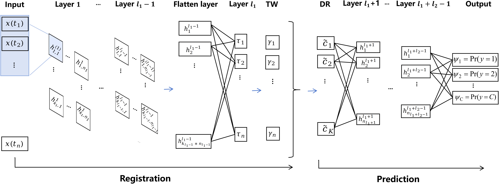

# DeepFRC update on 2025/5/11

## Introduction

DeepFRC is an end-to-end deep learning framework for joint functional registration and classification.

The Paper Link: 

## Getting Started

The code running order:

1# model/data/data_gen.ipynb

2# model/data/data_preprocess.ipynb

3# model/DeepFRC.ipynb
